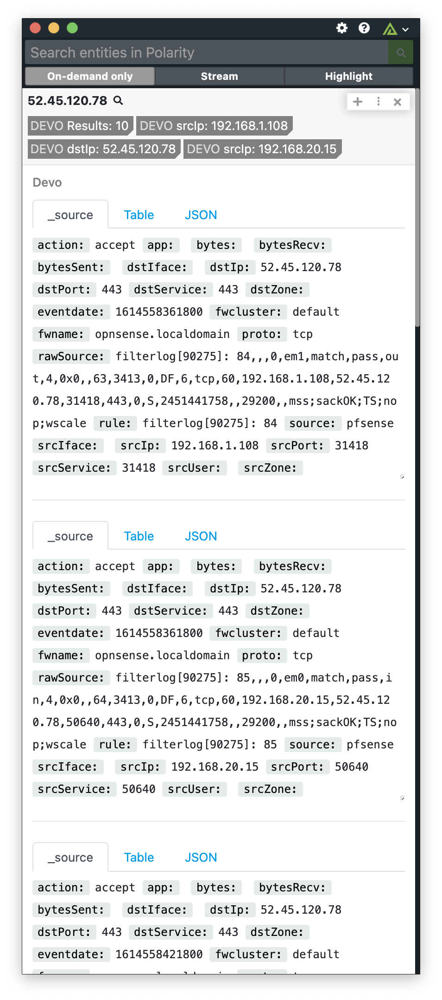

# Polarity Devo Integration

Polarity's Devo integration allows a user to connect and search a Devo instance.



## Required: Generation of OAuth authentication token

The Polarity-Devo integration requires a valid OAuth authentication token. For directions on how to enable Token Authentication please see the following Devo help page.

> https://docs.devo.com/confluence/ndt/domain-administration/security-credentials/authentication-tokens

## Devo Integration Options

### Base Devo URL

The base URL for the Devo REST API including the schema (i.e., https://) and port.

Default Devo REST API URL:

```
https://apiv2-us.devo.com/search
```

### Devo Authentication Token

A valid Devo OAuth Authentication Token.

### Devo Search String

This is the query that you want to run in Devo expressed as a LINQ script. Please ensure that your search contains the variable `{{ENTITY}}` in order for the search to be executed properly.  The variable represented by the string `{{ENTITY}}` will be replaced by the actual entity (i.e., an IP, hash, or email) that Polarity recognized on the user's screen.

For example, to search the `firewall.all.traffic` you might use a query like this:

```
from firewall.all.traffic where dstIp = {{ENTITY}}
```

#### Limit Searches by Time (Number of Days to Search)

As a general rule of thumb you should try to narrow down the search scope. A great way to limit the search scope is limit the time frame of data you are searching. The integration options include the ability to limit the amount of time searched as a integer representing the relative number days in the past from now.

#### Limit Searches by Records (Search Result Limit)

If your search can return more than 1 result you should always limit your query to only return a small number of events.  This can be done using the Search Result Limit parameter in the integration settings.

### Summary Fields

Comma delimited list of field values to include as part of the summary (no spaces between commas). These fields must be returned by your search query. This option must be set to "User can view and edit" or "User can view only".

 > It is important that this setting is set to "User can view only" or "User can view and edit".  This is required so the option is available to non-admin users in their Overlay Window.

 ## Installation Instructions

Installation instructions for integrations are provided on the [PolarityIO GitHub Page](https://polarityio.github.io/).

## Polarity

Polarity is a memory-augmentation platform that improves and accelerates analyst decision making.  For more information about the Polarity platform please see:

https://polarity.io/
